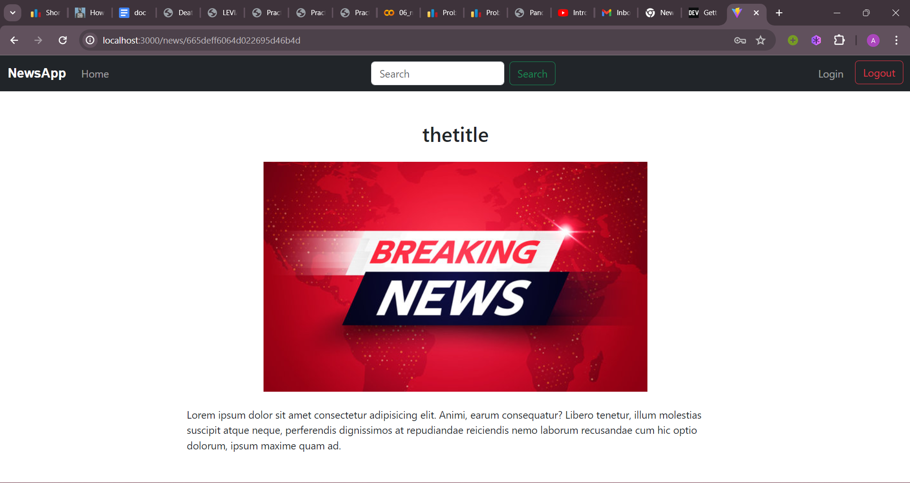

# NewsApp

NewsApp is a full-stack web application that allows users to view, bookmark, and manage news articles. The application features user authentication and authorization, a news feed with search functionality, and the ability to bookmark favorite news articles.

## Features
- User Authentication (Login/Register/Logout) using JWT
- View and search news articles
- Bookmark and unbookmark news articles
- Manage news articles (Create, Read, Update, Delete)
- Responsive design using Bootstrap
- Auto-refresh news feed

## Tech Stack
- Frontend: React, React Router, Axios, Bootstrap
- Backend: Node.js, Express.js
- Database: MongoDB, Mongoose
- Authentication: JSON Web Tokens (JWT), Cookies

## Installation

### Prerequisites
- Node.js (v14 or later)
- MongoDB (local or remote instance)

### Setup
Clone the repository:
git clone https://github.com/yourusername/newsapp.git
cd newsapp

Install backend dependencies:
cd backend
npm install

Install frontend dependencies:
cd ../frontend
npm install

Create a `.env` file in the backend directory and add the following:
NODE_ENV=development
PORT=5000
MONGO_URI=your_mongodb_uri
JWT_SECRET=your_jwt_secret

Start the backend server and the frontend development server:
npm run dev

## Usage
1. **Register a new user**: Navigate to the home page and register a new account.
2. **Login**: Use the registered credentials to log in.
3. **View news**: After logging in, navigate to the news page to view the latest news articles.
4. **Bookmark news**: Click the bookmark button on a news article to bookmark it. Click again to unbookmark.
5. **Manage news**: Create, update, or delete news articles if you have the required permissions.

## API Endpoints

### User Routes
- `POST /api/users`: Register a new user
- `POST /api/users/auth`: Authenticate user and get token
- `POST /api/users/logout`: Logout user

### News Routes
- `GET /api/news`: Get all news articles
- `POST /api/news`: Create a news article
- `PUT /api/news/:id`: Update a news article
- `DELETE /api/news/:id`: Delete a news article
- `GET /api/news/:id`: Get news article by ID

### Bookmark Routes
- `POST /api/bookmarks/:id`: Bookmark a news article
- `DELETE /api/bookmarks/:id/`: Unbookmark a news article
- `GET /api//bookmarks`: Get all bookmarked news articles of the user

## Working on:
- Date range and category filter on top of the page to search for particular news.
- improving UI.
